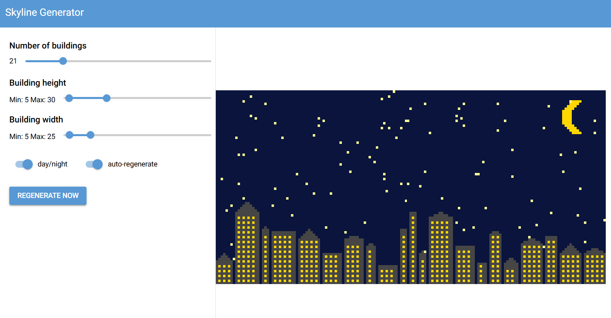

# 🏙️ Skyscraper Generator

A fun interactive app for generating stylized skylines with buildings, roofs, windows, sun/moon, clouds, and stars.  
Created as part of the **CitDev World Skyscraper Challenge**.

---

## ✨ Features

- Randomly generated buildings with flat, round, or pointy roofs
- Day and night modes (with sun, moon, stars, and clouds)
- Adjustable parameters: number of buildings, height, width ranges
- Auto-regenerate toggle or manual refresh
- Responsive web UI built with [NiceGUI](https://nicegui.io) and [Plotly](https://plotly.com/python/)

---

## 📸 Screenshots & Demos





---

## 🚀 How to Run

Clone the repository and run the app locally:

```bash
git clone https://github.com/yourusername/skyscraper-generator.git
cd skyscraper-generator

# install dependencies (uses uv, but pip/venv also works)
uv sync

# run the app
uv run app.py
```
The app will start a local server (default http://127.0.0.1:8080).
Open it in your browser to start generating skylines.

🛠️ Tech Stack

- Python 3.11+
- NiceGUI– UI framework
- Plotly – plotting
- NumPy – array manipulation
